# Akt 1 — story-graf

*Auto-genereret af `tools/story_graph.py` — redigér ikke i hånden.
Regenerér efter content-ændringer.*

- **92 elementer** (11 base)
- **95 kombinationer** (31 på komisk spor, vist stiplet)
- Kanter mærket med problem-løsninger, age-up og flags

```mermaid
flowchart LR
  arbejdsbord["🟧 Crafting table"]
  baad["🛶 Canoe"]
  baer(["🫐 Berries"]):::base
  bautasten["🗿 Standing stone"]
  boomerang["🪃 Boomerang"]
  bronze["🥉 Bronze"]
  brydekamp["🤼 Wrestling match"]
  damp["💨 Steam"]
  drive-in["🎬 Drive-in"]
  dyr(["🐗 Wild boar"]):::base
  farvet-skind["🧣 Dyed hide"]
  festdragt["🦚 Feather cloak"]
  fisk["🐟 Fish"]
  fjer["🪶 Feather"]
  flintmobil["🚗 Footmobile"]
  floejte["🪈 Bone flute"]
  flyveforsoeg["🪂 The Flight"]
  foenix["🐦‍🔥 Phoenix?"]
  fugl(["🐦 Bird"]):::base
  galleri["🖼️ Cave gallery"]
  garage["🅿️ Garage"]
  gnister["✨ Sparks"]
  graes(["🌾 Dry grass"]):::base
  grottebryg["🍺 Cave brew"]
  haandaftryk["🖐️ Handprint wall"]
  helbredelse["🩹 The Healing"]
  helligsted["⛩️ Shrine"]
  hjul["🛞 Wheel"]
  hulemaleri["🎨 Cave painting"]
  hytte["🛖 Hut"]
  ild["🔥 Fire"]
  ind-i-maleriet["🖌️ Into the painting"]
  kaelk["🛷 Sledge"]
  keramik["🏺 Pottery"]
  knogle["🦴 Bone"]
  knoglekast["🌌 Bone toss"]
  kobber["🟠 Copper"]
  koed["🥩 Meat"]
  koelle["🏏 Club"]
  krig["⚔️ The War"]
  kroning["👑 Coronation"]
  kul["⚫ Charcoal"]
  landsby["🏘️ Village"]
  larvebod["🏪 Grub stand"]
  larvefarm["🧺 Grub farm"]
  larver(["🐛 Grubs"]):::base
  legende["🌟 The Legend"]
  ler(["🟤 Clay"]):::base
  lerfigur["🪆 Clay figurine"]
  malm["⛏️ Ore"]
  medicin["🌿 Herbal remedy"]
  modeshow["💃 Fashion show"]
  mudder["🟫 Mud"]
  mudderbad["🛁 Mud bath"]
  mudderkage["🥧 Mud pie"]
  mursten["🧱 Mud brick"]
  nabo(["🧔 Neighbour"]):::base
  nedbraendt-hytte["🏚️ Burnt-down hut"]
  pind(["🪵 Stick"]):::base
  planker["🟫 Planks"]
  ristede-larver["🍢 Roasted grubs"]
  rockband["🎸 Rock band"]
  roeg["🌫️ Smoke"]
  roeget-koed["🥓 Smoked meat"]
  roegsignaler["📶 Smoke signals"]
  rullesten["⚪ Round stone"]
  saft["🧃 Berry juice"]
  shaman["🧙 Shaman Ugh"]
  sidste-maaltid["🍲 The Last Supper"]
  skind["🧥 Hide cloak"]
  slagsmaal["💢 First argument"]
  spyd["🔱 Spear"]
  stamme(["🪵 Log"]):::base
  stegt-koed["🍖 Roast meat"]
  sten(["🪨 Stone"]):::base
  stenalderfest["🎉 Stone age party"]
  stenkoncert["🤘 Stonehenge gig"]
  stenkreds["🌀 Stone circle"]
  stenoekse["🪓 Stone axe"]
  stenspil["🎳 Boules"]
  surf-n-turf["🍽️ Surf 'n' turf"]
  syner["🍄 Visions"]
  tamsvin["🐖 Pet boar"]
  toemmerflaade["🏄 Raft"]
  toemmermaend["🤕 Hangover"]
  trafikprop["🚦 Traffic jam"]
  tromme["🥁 Drum"]
  trommesolo["🎶 Drum solo"]
  vand(["💧 Water"]):::base
  ven["🫙 Pot friend"]
  vinger["🪽 Wings"]
  vogn["🛒 Cart"]
  sten --> gnister
  gnister -->|"løser kulde"| ild
  graes --> ild
  sten -->|"løser vaerktoej"| stenoekse
  pind --> stenoekse
  stenoekse --> spyd
  pind --> spyd
  spyd --> koed
  dyr --> koed
  ild -->|"løser sult"| stegt-koed
  koed --> stegt-koed
  larver -..->|"løser sult · flag larver"| ristede-larver
  ild -..-> ristede-larver
  ler --> mudder
  vand --> mudder
  mudder -..->|"flag stinker"| mudderbad
  ler --> keramik
  ild --> keramik
  ild --> damp
  vand --> damp
  stenoekse --> malm
  sten --> malm
  malm --> kobber
  ild --> kobber
  kobber -->|"AGE-UP"| bronze
  malm --> bronze
  larver -..-> larvefarm
  ler -..-> larvefarm
  sten --> rullesten
  vand --> rullesten
  rullesten --> hjul
  stenoekse --> hjul
  stamme --> planker
  stenoekse --> planker
  planker -..-> arbejdsbord
  hjul --> vogn
  planker --> vogn
  vogn -..->|"3 somre · flag bilist"| flintmobil
  nabo -..-> flintmobil
  sten --> bautasten
  mudder --> bautasten
  bautasten -->|"2 somre"| stenkreds
  dyr -..-> tamsvin
  baer -..-> tamsvin
  vand -->|"løser sult"| fisk
  spyd --> fisk
  koed -->|"løser kulde · flag pelsklaedt"| skind
  stenoekse --> skind
  baer -->|"flag kunstner"| hulemaleri
  sten --> hulemaleri
  stamme --> tromme
  pind --> tromme
  tromme -..->|"2 somre · flag rockstjerne"| rockband
  nabo -..-> rockband
  baer --> grottebryg
  keramik --> grottebryg
  grottebryg -..->|"flag festabe"| stenalderfest
  nabo -..-> stenalderfest
  keramik -..-> ven
  hulemaleri -..-> ven
  pind --> boomerang
  larvefarm -..->|"2 somre"| larvebod
  nabo -..-> larvebod
  mudder --> mursten
  graes --> mursten
  mursten -->|"løser kulde"| hytte
  hytte -->|"2 somre"| landsby
  nabo --> landsby
  hytte -..->|"flag brandstifter"| nedbraendt-hytte
  ild -..-> nedbraendt-hytte
  stamme --> toemmerflaade
  vand --> toemmerflaade
  toemmerflaade --> baad
  stenoekse --> baad
  ild --> roeg
  graes --> roeg
  roeg --> roegsignaler
  nabo --> roegsignaler
  hulemaleri --> helligsted
  bautasten --> helligsted
  nabo --> shaman
  helligsted --> shaman
  shaman -..->|"2 somre"| syner
  grottebryg -..-> syner
  ild --> kul
  stamme --> kul
  koed --> roeget-koed
  roeg --> roeget-koed
  baer --> saft
  vand --> saft
  mudder -..->|"løser sult · flag mudderspiser"| mudderkage
  baer -..-> mudderkage
  fisk -..-> surf-n-turf
  stegt-koed -..-> surf-n-turf
  dyr --> knogle
  stenoekse --> knogle
  knogle --> koelle
  pind --> koelle
  koelle -..-> slagsmaal
  nabo -..-> slagsmaal
  knogle -..-> knoglekast
  bautasten -..-> knoglekast
  fugl -..-> foenix
  ild -..-> foenix
  fugl --> fjer
  boomerang --> fjer
  knogle --> floejte
  fugl --> floejte
  skind --> farvet-skind
  baer --> farvet-skind
  fjer -->|"2 somre"| festdragt
  skind --> festdragt
  festdragt -..->|"2 somre · flag modeikon"| modeshow
  nabo -..-> modeshow
  ler --> lerfigur
  nabo --> lerfigur
  hulemaleri --> haandaftryk
  nabo --> haandaftryk
  rockband -..->|"3 somre"| stenkoncert
  stenkreds -..-> stenkoncert
  tromme -..-> trommesolo
  hulemaleri --> galleri
  flintmobil -..->|"2 somre"| garage
  hytte -..-> garage
  flintmobil -..->|"2 somre"| drive-in
  hulemaleri -..-> drive-in
  flintmobil -..->|"2 somre"| trafikprop
  rullesten -..-> stenspil
  nabo -..-> brydekamp
  planker --> kaelk
  stamme --> kaelk
  grottebryg -..-> toemmermaend
  gnister -->|"løser kulde"| ild
  pind --> ild
  mudder --> keramik
  ild --> keramik
  rullesten --> hjul
  pind --> hjul
  kul --> hulemaleri
  sten --> hulemaleri
  skind --> tromme
  keramik --> tromme
  toemmerflaade -->|"løser sult"| fisk
  spyd --> fisk
  saft --> grottebryg
  keramik --> grottebryg
  sten --> bautasten
  nabo --> bautasten
  hjul --> vogn
  ild --> roeg
  ild --> kul
  planker --> kul
  baer --> saft
  rullesten --> saft
  stegt-koed --> knogle
  nabo --> knogle
  fugl --> fjer
  nabo --> fjer
  fjer -..-> vinger
  knogle --> medicin
  saft --> medicin
  landsby -->|"SLUTNING: king-karl · 3 somre"| kroning
  festdragt --> kroning
  stenkoncert -..->|"SLUTNING: rock-legend · 4 somre"| legende
  trommesolo -..-> legende
  syner -..->|"SLUTNING: mad-painter · 3 somre"| ind-i-maleriet
  hulemaleri -..-> ind-i-maleriet
  vinger -..->|"SLUTNING: icarus · 2 somre"| flyveforsoeg
  bautasten -..-> flyveforsoeg
  slagsmaal -->|"SLUTNING: general · 3 somre"| krig
  koelle --> krig
  medicin -->|"SLUTNING: doctor · 2 somre"| helbredelse
  nabo --> helbredelse
  mudderkage -..->|"SLUTNING: gourmet"| sidste-maaltid
  grottebryg -..-> sidste-maaltid
  class ristede-larver komisk
  class mudderbad komisk
  class larvefarm komisk
  class arbejdsbord komisk
  class flintmobil komisk
  class tamsvin komisk
  class rockband komisk
  class stenalderfest komisk
  class ven komisk
  class larvebod komisk
  class nedbraendt-hytte komisk
  class syner komisk
  class mudderkage komisk
  class surf-n-turf komisk
  class slagsmaal komisk
  class knoglekast komisk
  class foenix komisk
  class modeshow komisk
  class stenkoncert komisk
  class trommesolo komisk
  class garage komisk
  class drive-in komisk
  class trafikprop komisk
  class stenspil komisk
  class brydekamp komisk
  class toemmermaend komisk
  class vinger komisk
  class legende komisk
  class ind-i-maleriet komisk
  class flyveforsoeg komisk
  class sidste-maaltid komisk
  class kroning ending
  class legende ending
  class ind-i-maleriet ending
  class flyveforsoeg ending
  class krig ending
  class helbredelse ending
  class sidste-maaltid ending
  classDef base fill:#e8dcc0,stroke:#7a5b3a
  classDef komisk fill:#ffe0b3,stroke:#c2762b,stroke-dasharray: 5 3
  classDef ending fill:#2b2b2b,stroke:#e0a458,stroke-width:3px,color:#fff
```

