# Akt 1 — story-graf

*Auto-genereret af `tools/story_graph.py` — redigér ikke i hånden.
Regenerér efter content-ændringer.*

- **165 elementer** (11 base)
- **205 kombinationer** (48 på komisk spor, vist stiplet)
- Kanter mærket med problem-løsninger, age-up og flags

```mermaid
flowchart LR
  aand["👻 Ancestor spirit"]
  agern["🌰 Acorn"]
  arbejdsbord["🧰 Crafting table"]
  baad["🛶 Canoe"]
  baer(["🫐 Berries"]):::base
  bautasten["🗿 Standing stone"]
  besoegende["🛸 The Visitors"]
  boomerang["🪃 Boomerang"]
  broed["🍞 Bread"]
  bronze["🥉 Bronze"]
  brydekamp["🤼 Wrestling match"]
  bue["🏹 Bow"]
  damp["💨 Steam"]
  dans["🕺 Ritual dance"]
  dej["🥟 Dough"]
  den-lange-vinter["🏔️ The Long Winter"]
  drive-in["🎬 Drive-in"]
  dyr(["🐗 Wild boar"]):::base
  eftermaele["🕊️ Legacy"]
  faelde["🪤 Snare"]
  faeldegrav["💥 Booby trap"]
  familie["👨‍👩‍👦 Family"]
  fangst["🎣 Great catch"]
  farvet-skind["🧣 Dyed hide"]
  festdragt["🦚 Feather cloak"]
  fisk["🐟 Fish"]
  fjer["🪶 Feather"]
  flintmobil["🚗 Footmobile"]
  floejte["🪈 Bone flute"]
  flyveforsoeg["🪂 The Flight"]
  foenix["🐦‍🔥 Phoenix?"]
  fossil["🦕 Fossil"]
  froe["🌱 Seeds"]
  fugl(["🐦 Bird"]):::base
  galleri["🖼️ Cave gallery"]
  garage["🅿️ Garage"]
  gave["🎁 Gift"]
  gnister["✨ Sparks"]
  graes(["🍂 Dry grass"]):::base
  grav["⚰️ Burial"]
  grottebryg["🍺 Cave brew"]
  haandaftryk["🖐️ Handprint wall"]
  haarklip["💇 Haircut"]
  handel["🤝 Trade"]
  have["🌻 Garden"]
  havrejsen["⛵ The Voyage"]
  helbredelse["🩹 The Healing"]
  helligkrukke["🏆 The Sacred Pot"]
  helligsted["⛩️ Shrine"]
  hjul["🛞 Wheel"]
  hoest["🌽 Harvest"]
  hoevding["🫅 Chief"]
  hulemaleri["🎨 Cave painting"]
  hund["🐕 Dog"]
  hytte["🛖 Hut"]
  idol["🧿 Golden idol"]
  ild["🔥 Fire"]
  ind-i-maleriet["🖌️ Into the painting"]
  is["🧊 Ice"]
  jagtfoelge["🫂 Hunting party"]
  kaelk["🛷 Sledge"]
  kalender["📅 Calendar"]
  keramik["🏺 Pottery"]
  knogle["🦴 Bone"]
  knoglekast["🌌 Bone toss"]
  kobber["🟠 Copper"]
  koed["🥩 Meat"]
  koelle["🏏 Club"]
  kort["🗺️ Map"]
  krig["⚔️ The War"]
  kro["🍻 The Tavern"]
  kroning["👑 Coronation"]
  kul["⚫ Charcoal"]
  landsby["🏘️ Village"]
  larvebod["🏪 Grub stand"]
  larvefarm["🧺 Grub farm"]
  larver(["🐛 Grubs"]):::base
  legende["🌟 The Legend"]
  ler(["🟤 Clay"]):::base
  lerfigur["🪆 Clay figurine"]
  levende-gud["🌞 The Living God"]
  lov["📜 The first law"]
  lyn["⚡ Lightning"]
  malm["⛏️ Ore"]
  mammut["🦣 Mammoth"]
  mammuthus["🏛️ Mammoth-bone hut"]
  marked["🎪 Market"]
  maske["🎭 Mask"]
  medicin["🌿 Herbal remedy"]
  mel["🍚 Flour"]
  mester["🏅 The Champion"]
  modeshow["💃 Fashion show"]
  monolit["⬛ The Monolith"]
  mudder["🟫 Mud"]
  mudderbad["🛁 Mud bath"]
  mudderkage["🥧 Mud pie"]
  mursten["🧱 Mud brick"]
  myg-i-rav["🦟 Insect in amber"]
  myte["📖 Myth"]
  naal["🪡 Bone needle"]
  nabo(["🧔 Neighbour"]):::base
  nedbraendt-hytte["🏚️ Burnt-down hut"]
  net["🕸️ Net"]
  oversvoemmelse["🌊 The Flood"]
  penge["💰 Shell money"]
  pil["🎯 Arrow"]
  pind(["🥢 Stick"]):::base
  planker["🟧 Planks"]
  rav["🟡 Amber"]
  reb["🪢 Rope"]
  regn["🌧️ Rain"]
  regnskab["📊 Accounts"]
  ristede-larver["🍢 Roasted grubs"]
  ritual["🔮 Ritual"]
  rockband["🎸 Rock band"]
  roeg["🌫️ Smoke"]
  roeget-koed["🥓 Smoked meat"]
  roegsignaler["📶 Smoke signals"]
  romance["💘 Romance"]
  rullesten["⚪ Round stone"]
  saft["🧃 Berry juice"]
  shaman["🧙 Shaman Ugh"]
  sidste-maaltid["🍲 The Last Supper"]
  skal["🐚 Shell"]
  ski["🎿 Skis"]
  skind["🧥 Hide cloak"]
  skovmand["🦧 The Hairy One"]
  skrift["✍️ Writing"]
  sky["☁️ Cloud"]
  slagsmaal["💢 First argument"]
  smykke["📿 Necklace"]
  sne["❄️ Snow"]
  soeuhyre["🐉 Lake monster"]
  solgud["☀️ Sun god"]
  spejl["🪞 Reflection"]
  splint["🩼 Splint"]
  spyd["🔱 Spear"]
  stamme(["🪵 Log"]):::base
  stammefolk["🏕️ Tribe"]
  stegt-koed["🍖 Roast meat"]
  sten(["🪨 Stone"]):::base
  stenalderfest["🎉 Stone age party"]
  stenkoncert["🤘 Stonehenge gig"]
  stenkreds["🌀 Stone circle"]
  stenoekse["🪓 Stone axe"]
  stenspil["🎳 Boules"]
  sunkne-by["🏝️ The Sunken Village"]
  surf-n-turf["🍽️ Surf 'n' turf"]
  symbol["🔣 Symbol"]
  syner["🍄 Visions"]
  taellekaep["🧮 Tally stick"]
  tamsvin["🐖 Pet boar"]
  tatovering["🖋️ Tattoo"]
  toej["👕 Sewn clothes"]
  toemmerflaade["🏄 Raft"]
  toemmermaend["🤕 Hangover"]
  traening["🥊 Training montage"]
  trafikprop["🚦 Traffic jam"]
  tromme["🥁 Drum"]
  trommesolo["🎶 Drum solo"]
  ulv["🐺 Wolf"]
  vand(["💧 Water"]):::base
  ven["🫙 Pot friend"]
  vinger["🪽 Wings"]
  vogn["🛒 Cart"]
  sten --> gnister
  gnister -->|"løser kulde"| ild
  graes --> ild
  sten -->|"løser vaerktoej"| stenoekse
  pind --> stenoekse
  stenoekse --> spyd
  pind --> spyd
  spyd --> koed
  dyr --> koed
  ild -->|"løser sult"| stegt-koed
  koed --> stegt-koed
  larver -..->|"løser sult · flag larver"| ristede-larver
  ild -..-> ristede-larver
  ler --> mudder
  vand --> mudder
  mudder -..->|"flag stinker"| mudderbad
  ler --> keramik
  ild --> keramik
  ild --> damp
  vand --> damp
  stenoekse --> malm
  sten --> malm
  malm --> kobber
  ild --> kobber
  kobber -->|"AGE-UP"| bronze
  malm --> bronze
  larver -..-> larvefarm
  ler -..-> larvefarm
  sten --> rullesten
  vand --> rullesten
  rullesten --> hjul
  stenoekse --> hjul
  stamme --> planker
  stenoekse --> planker
  planker -..-> arbejdsbord
  hjul --> vogn
  planker --> vogn
  vogn -..->|"3 somre · flag bilist"| flintmobil
  nabo -..-> flintmobil
  sten --> bautasten
  mudder --> bautasten
  bautasten -->|"2 somre"| stenkreds
  dyr -..-> tamsvin
  baer -..-> tamsvin
  vand -->|"løser sult"| fisk
  spyd --> fisk
  koed -->|"løser kulde · flag pelsklaedt"| skind
  stenoekse --> skind
  baer -->|"flag kunstner"| hulemaleri
  sten --> hulemaleri
  stamme --> tromme
  pind --> tromme
  tromme -..->|"2 somre · flag rockstjerne"| rockband
  nabo -..-> rockband
  baer --> grottebryg
  keramik --> grottebryg
  grottebryg -..->|"flag festabe"| stenalderfest
  nabo -..-> stenalderfest
  keramik -..-> ven
  hulemaleri -..-> ven
  pind --> boomerang
  larvefarm -..->|"2 somre"| larvebod
  nabo -..-> larvebod
  mudder --> mursten
  graes --> mursten
  mursten -->|"løser kulde"| hytte
  hytte -->|"2 somre"| landsby
  nabo --> landsby
  hytte -..->|"flag brandstifter"| nedbraendt-hytte
  ild -..-> nedbraendt-hytte
  stamme --> toemmerflaade
  vand --> toemmerflaade
  toemmerflaade --> baad
  stenoekse --> baad
  ild --> roeg
  graes --> roeg
  roeg --> roegsignaler
  nabo --> roegsignaler
  hulemaleri --> helligsted
  bautasten --> helligsted
  nabo --> shaman
  helligsted --> shaman
  shaman -..->|"2 somre"| syner
  grottebryg -..-> syner
  ild --> kul
  stamme --> kul
  koed --> roeget-koed
  roeg --> roeget-koed
  baer --> saft
  vand --> saft
  mudder -..->|"løser sult · flag mudderspiser"| mudderkage
  baer -..-> mudderkage
  fisk -..-> surf-n-turf
  stegt-koed -..-> surf-n-turf
  dyr --> knogle
  stenoekse --> knogle
  knogle --> koelle
  pind --> koelle
  koelle -..-> slagsmaal
  nabo -..-> slagsmaal
  knogle -..-> knoglekast
  bautasten -..-> knoglekast
  fugl -..-> foenix
  ild -..-> foenix
  fugl --> fjer
  boomerang --> fjer
  knogle --> floejte
  fugl --> floejte
  skind --> farvet-skind
  baer --> farvet-skind
  fjer -->|"2 somre"| festdragt
  skind --> festdragt
  festdragt -..->|"2 somre · flag modeikon"| modeshow
  nabo -..-> modeshow
  ler --> lerfigur
  nabo --> lerfigur
  hulemaleri --> haandaftryk
  nabo --> haandaftryk
  rockband -..->|"3 somre"| stenkoncert
  stenkreds -..-> stenkoncert
  tromme -..-> trommesolo
  hulemaleri --> galleri
  flintmobil -..->|"2 somre"| garage
  hytte -..-> garage
  flintmobil -..->|"2 somre"| drive-in
  hulemaleri -..-> drive-in
  flintmobil -..->|"2 somre"| trafikprop
  rullesten -..-> stenspil
  nabo -..-> brydekamp
  planker --> kaelk
  stamme --> kaelk
  grottebryg -..-> toemmermaend
  gnister -->|"løser kulde"| ild
  pind --> ild
  mudder --> keramik
  ild --> keramik
  rullesten --> hjul
  pind --> hjul
  kul --> hulemaleri
  sten --> hulemaleri
  skind --> tromme
  keramik --> tromme
  toemmerflaade -->|"løser sult"| fisk
  spyd --> fisk
  saft --> grottebryg
  keramik --> grottebryg
  sten --> bautasten
  nabo --> bautasten
  hjul --> vogn
  ild --> roeg
  ild --> kul
  planker --> kul
  baer --> saft
  rullesten --> saft
  stegt-koed --> knogle
  nabo --> knogle
  fugl --> fjer
  nabo --> fjer
  fjer -..-> vinger
  knogle --> medicin
  saft --> medicin
  landsby -->|"SLUTNING: king-karl · 3 somre"| kroning
  festdragt --> kroning
  stenkoncert -..->|"SLUTNING: rock-legend · 4 somre"| legende
  trommesolo -..-> legende
  syner -..->|"SLUTNING: mad-painter · 3 somre"| ind-i-maleriet
  hulemaleri -..-> ind-i-maleriet
  vinger -..->|"SLUTNING: icarus · 2 somre"| flyveforsoeg
  bautasten -..-> flyveforsoeg
  slagsmaal -->|"SLUTNING: general · 3 somre"| krig
  koelle --> krig
  medicin -->|"SLUTNING: doctor · 2 somre"| helbredelse
  nabo --> helbredelse
  mudderkage -..->|"SLUTNING: gourmet"| sidste-maaltid
  grottebryg -..-> sidste-maaltid
  damp --> sky
  sky --> regn
  regn --> lyn
  bautasten --> lyn
  lyn -->|"løser kulde"| ild
  graes --> ild
  sky -..-> sne
  fjer -..-> sne
  sne --> is
  is -->|"SLUTNING: long-winter · 2 somre"| den-lange-vinter
  sne --> den-lange-vinter
  sne -..-> ski
  planker -..-> ski
  graes --> reb
  reb --> net
  net --> fangst
  fisk --> fangst
  reb --> faelde
  pind --> faelde
  faelde --> ulv
  koed --> ulv
  ulv -->|"flag hundeejer"| hund
  stegt-koed --> hund
  reb --> bue
  stenoekse --> bue
  bue --> pil
  fjer --> pil
  pil --> koed
  dyr --> koed
  stenalderfest --> romance
  festdragt --> romance
  romance -->|"2 somre · flag familiefar"| familie
  hytte --> familie
  familie -->|"2 somre"| stammefolk
  landsby --> stammefolk
  knogle --> grav
  helligsted --> grav
  grav -->|"SLUTNING: remembered · 3 somre"| eftermaele
  hulemaleri --> eftermaele
  keramik --> handel
  gave --> handel
  nabo --> gave
  keramik --> gave
  fisk --> skal
  rullesten --> skal
  skal --> penge
  handel --> penge
  penge -->|"2 somre"| marked
  landsby --> marked
  stammefolk -..-> hoevding
  koelle -..-> hoevding
  hoevding -->|"2 somre"| lov
  bautasten --> lov
  shaman --> ritual
  tromme --> ritual
  syner -..-> aand
  grav -..-> aand
  aand --> myte
  hulemaleri --> myte
  myte -->|"2 somre"| solgud
  stenkreds --> solgud
  shaman --> maske
  skind --> maske
  maske -..-> dans
  ritual -..-> dans
  solgud -..->|"SLUTNING: living-god · 3 somre"| levende-gud
  dans -..-> levende-gud
  knogle --> naal
  fjer --> naal
  naal -->|"løser kulde"| toej
  skind --> toej
  naal -..-> tatovering
  kul -..-> tatovering
  vand --> spejl
  keramik --> spejl
  spejl -..-> haarklip
  stenoekse -..-> haarklip
  knogle --> splint
  reb --> splint
  baer --> froe
  froe --> have
  mudder --> have
  have -->|"2 somre"| hoest
  regn --> hoest
  hund --> fangst
  faelde --> fangst
  ski --> kaelk
  sne --> kaelk
  toej --> festdragt
  fjer --> festdragt
  reb --> toemmerflaade
  stamme --> toemmerflaade
  lyn --> gnister
  sten --> gnister
  hund --> jagtfoelge
  nabo --> jagtfoelge
  sten --> fossil
  knogle --> fossil
  stamme --> rav
  is --> rav
  rav -..-> myg-i-rav
  larver -..-> myg-i-rav
  fossil -..-> soeuhyre
  myte -..-> soeuhyre
  fossil --> mammuthus
  mammut --> mammuthus
  bautasten -->|"2 somre"| monolit
  is --> monolit
  monolit -..->|"2 somre"| besoegende
  aand -..-> besoegende
  besoegende -..-> idol
  hoevding -..-> idol
  baer --> agern
  stamme --> agern
  agern --> faelde
  hund --> faelde
  dyr --> mammut
  sne --> mammut
  mammut -->|"2 somre"| koed
  jagtfoelge --> koed
  mammut --> mammuthus
  knogle --> mammuthus
  hoest --> mel
  rullesten --> mel
  mel --> dej
  vand --> dej
  dej -->|"løser sult"| broed
  ild --> broed
  broed -..->|"2 somre"| kro
  grottebryg -..-> kro
  mel --> dej
  keramik --> dej
  regn -->|"2 somre · flag oversvoemmet"| oversvoemmelse
  landsby --> oversvoemmelse
  oversvoemmelse -->|"2 somre"| sunkne-by
  myte --> sunkne-by
  vand --> soeuhyre
  aand --> soeuhyre
  ulv -..-> skovmand
  syner -..-> skovmand
  brydekamp -..-> traening
  tromme -..-> traening
  traening -..->|"2 somre"| mester
  bautasten -..-> mester
  mester -->|"2 somre"| kroning
  festdragt --> kroning
  helligsted --> helligkrukke
  keramik --> helligkrukke
  helligkrukke -..-> faeldegrav
  faelde -..-> faeldegrav
  idol --> ritual
  helligsted --> ritual
  knogle --> taellekaep
  naal --> taellekaep
  taellekaep --> regnskab
  handel --> regnskab
  myte -->|"3 somre"| skrift
  symbol --> skrift
  hulemaleri --> symbol
  taellekaep --> symbol
  hulemaleri --> kort
  skind --> kort
  stenkreds -->|"2 somre"| kalender
  solgud --> kalender
  kalender -->|"løser sult"| broed
  hoest --> broed
  baad -->|"SLUTNING: voyage · 3 somre"| havrejsen
  ven --> havrejsen
  kort -->|"SLUTNING: voyage · 3 somre"| havrejsen
  baad --> havrejsen
  hund --> tamsvin
  dyr --> tamsvin
  net --> fjer
  fugl --> fjer
  bue --> jagtfoelge
  nabo --> jagtfoelge
  is --> spejl
  keramik --> spejl
  skrift --> regnskab
  lov --> regnskab
  froe --> have
  hoest --> have
  broed --> surf-n-turf
  roeget-koed --> surf-n-turf
  kro --> stenalderfest
  nabo --> stenalderfest
  marked --> penge
  gave --> penge
  dans --> ritual
  stenalderfest --> ritual
  maske --> idol
  hulemaleri --> idol
  hund --> jagtfoelge
  sne --> is
  hytte --> is
  lyn --> kul
  stamme --> kul
  regn --> have
  froe --> have
  fangst --> roeget-koed
  ild --> roeget-koed
  skal --> smykke
  naal --> smykke
  smykke -->|"2 somre"| familie
  romance --> familie
  mammut -->|"løser kulde"| toej
  skind --> toej
  rav --> penge
  smykke --> penge
  kalender --> myte
  shaman --> myte
  taellekaep --> kalender
  sten --> kalender
  class ristede-larver komisk
  class mudderbad komisk
  class larvefarm komisk
  class arbejdsbord komisk
  class flintmobil komisk
  class tamsvin komisk
  class rockband komisk
  class stenalderfest komisk
  class ven komisk
  class larvebod komisk
  class nedbraendt-hytte komisk
  class syner komisk
  class mudderkage komisk
  class surf-n-turf komisk
  class slagsmaal komisk
  class knoglekast komisk
  class foenix komisk
  class modeshow komisk
  class stenkoncert komisk
  class trommesolo komisk
  class garage komisk
  class drive-in komisk
  class trafikprop komisk
  class stenspil komisk
  class brydekamp komisk
  class toemmermaend komisk
  class vinger komisk
  class legende komisk
  class ind-i-maleriet komisk
  class flyveforsoeg komisk
  class sidste-maaltid komisk
  class sne komisk
  class ski komisk
  class hoevding komisk
  class aand komisk
  class dans komisk
  class levende-gud komisk
  class tatovering komisk
  class haarklip komisk
  class myg-i-rav komisk
  class soeuhyre komisk
  class besoegende komisk
  class idol komisk
  class kro komisk
  class skovmand komisk
  class traening komisk
  class mester komisk
  class faeldegrav komisk
  class kroning ending
  class legende ending
  class ind-i-maleriet ending
  class flyveforsoeg ending
  class krig ending
  class helbredelse ending
  class sidste-maaltid ending
  class den-lange-vinter ending
  class eftermaele ending
  class levende-gud ending
  class havrejsen ending
  class havrejsen ending
  classDef base fill:#e8dcc0,stroke:#7a5b3a
  classDef komisk fill:#ffe0b3,stroke:#c2762b,stroke-dasharray: 5 3
  classDef ending fill:#2b2b2b,stroke:#e0a458,stroke-width:3px,color:#fff
```

